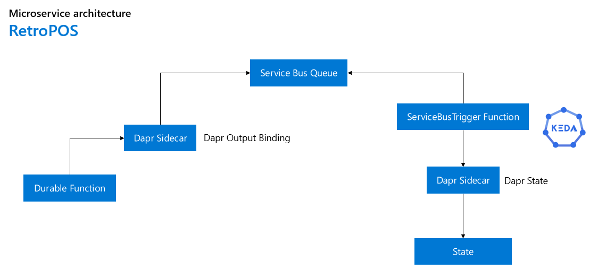

# Dapr Retro Point of Sales

## Summary

1. Workflow - 1
2. Workflow - 2
3. Azure Deployment
4. AAD Pod Identity

## Workflow 1

The purpose of this workflow it's to represent a Durable Orchestration Function that will be sending messages by using an output binding in the Dapr sidecar component, these messages will be stored in the Azure Service Bus Queue and eventually they will be consumed and processed by a ServiceBusTrigger Function to finally send the results to an storage in the Dapr sidecar component to be successfully saved.

<div>
    
</div>

In this scenario, some KEDA components were added, to horizontal autoscale the pods based on the amount of events received in the queue, this behavior will be only available in Kubernetes.

Note: During the development of the project, I found some early adoption considerations, the first one, it's the lack of the support of Dapr queue trigger for Service Bus Queues, this forced to me to use the ServiceBusTrigger Function instead of a possible DaprQueueTrigger, this creates a direct dependency to the Service Bus resource, but once we have the Dapr queue trigger available for Functions, the resource will be fully adaptive to other non-Azure components, for further details about the Dapr Functions Extension project: https://github.com/dapr/azure-functions-extension.

### Development configuration

Requirements:

- Visual Studio 2019 or Visual Studio Code
- .NET Core 3.1
- Azure Functions Extensions
- Docker Desktop
- Dapr

For this scenario you will need to work with the following projects:

- source/RetroPOS.DurableOrchestration.Api
- source/RetroPOS.Consumer.Api

Components required:

- Output Binding (Dapr) - Azure Service Bus
- State (Dapr) - Redis, CosmosDB or any other supported component by Dapr
- State (Azure Functions) - Azure Storage

Introductory documentation:

- [Dapr overview](https://github.com/dapr/docs/tree/master/overview)
- [Dapr building blocks](https://github.com/dapr/docs/tree/master/concepts#building-blocks)
- [Setup Dapr development environment](https://github.com/dapr/dapr/blob/master/docs/development/setup-dapr-development-env.md)
- [Launch dapr and your app](https://github.com/dapr/cli#launch-dapr-and-your-app)
- [Application development with Visual Studio Code](https://github.com/dapr/docs/tree/master/howto/vscode-debugging-daprd)
- [Bindings](https://github.com/dapr/docs/tree/master/concepts/bindings)
- [Azure Service Bus Queues binding specification](https://github.com/dapr/docs/blob/master/reference/specs/bindings/servicebusqueues.md)
- [State management](https://github.com/dapr/docs/tree/master/concepts/state-management)
- [State API](https://github.com/dapr/docs/blob/master/reference/api/state_api.md)
- [Supported state stores](https://github.com/dapr/components-contrib/tree/master/state)
- [How to setup state stores](https://github.com/dapr/docs/tree/master/howto/setup-state-store)

Microservices port configuration for debugging:

| services  | http | http-dapr | grpc-dapr | metrics-dapr | daprd command |
|---|---|---|---|---|---|
| RetroPOS.DurableOrchestration.Api | 5000 | 5100 | 5200 | 5300 | daprd -app-id durable-orchestration-api -components-path source\RetroPOS.Dapr.Components -app-port 5000 -dapr-http-port 5100 -dapr-grpc-port 5200 -metrics-port 5300 -log-level debug |
| RetroPOS.Consumer.Api | 6000 | 6100 | 6200 | 6300 | daprd -app-id consumer-api -components-path source\RetroPOS.Dapr.Components -app-port 6000 -dapr-http-port 6100 -dapr-grpc-port 6200 -metrics-port 6300 -log-level debug |


## Script for Azure resources deployment

Run the script: powershell/azure-deployment.ps1 to deploy the Azure resources.

```bash
.\powershell\azure-deployment.ps1
```

Note: At the end of the script execution there is a call to action to save the information that will be used in the future, be sure keep safe that information.

## Script for Azure resources removal

Run the script: powershell/azure-removal.ps1 to remove the Azure resources.
    
```bash
.\powershell\azure-removal.ps1
```

## Finishing the AAD Pod Identity configuration on Kubernetes

Once the Azure services has been deployed, Azure Kubernetes Service is now configured with Managed Identity service with the grants to access the Container Registry and Azure Key Vault. 

Now it's time to configure the rest of the AAD Pod Identity and CSI Secrets Store Provider to connect Kubernetes in a secure way to Key Vault and use the managed secrets.

Steps:

1. Using the Azure CLI download the cluster credentials in the local environment or if you prefer use the Azure Shell.

    ```bash
    az aks get-credentials -n [Kubernetes Service name] -g [Kubernetes Service resource group]
    ```

2. Using the Azure CLI install the Kubectl command line interface.

    ```bash
    az aks install-cli
    ```

3. Install Secrets Store CSI driver and Key Vault Provider.
    
    ```bash
    helm repo add csi-secrets-store-provider-azure https://raw.githubusercontent.com/Azure/secrets-store-csi-driver-provider-azure/master/charts

    kubectl create ns csi-driver

    helm install csi-azure csi-secrets-store-provider-azure/csi-secrets-store-provider-azure --namespace csi-driver
    ```

4. Install Aad-Pod-Identity on Kubernetes.

    ```bash
    kubectl apply -f https://raw.githubusercontent.com/Azure/aad-pod-identity/master/deploy/infra/deployment-rbac.yaml
    ```

    Note: For more information: https://github.com/Azure/aad-pod-identity.

5. Run the script: powershell/aad-permissions.ps1 to assign permissions.

    To run the script you need to modified the following values with the right ones before execute the script.

    ```bash
    - SubscriptionId="[REPLACE]"
    - KubernetesName="[REPLACE]"
    - KeyVaultName="[REPLACE]"
    - ResourceGroupName="[REPLACE]"
    ```

    ```bash
    .\powershell\aad-permissions.ps1
    ```

6. Run the script: kubernetes/aad-pod-identity/kubernetes.azureidentity.yml.

    To install the script you need to configure the identity resourceID and clientID before execute the script.

    ```bash
    kubectl apply -f kubernetes/aad-pod-identity/kubernetes.azureidentity.yml
    ```

7. Run the script: kubernetes/aad-pod-identity/kubernetes.azureidentitybinding.yml.

    ```bash
    kubectl apply -f kubernetes/aad-pod-identity/kubernetes.azureidentitybinding.yml
    ```

## Deploying the applications

1. Create the retropos-system namespace.

    ```bash
    kubectl create ns retropos-system
    ```

## Credits

I want to thank to my Cloud Native Global Black Belt team (aka. Dapr Vigilantes) for this great contribution: https://github.com/azure/dapr-gbb-workshop that I used to accelerate my learning and adoption of Dapr.

I want to thank Houssem Dellai (@houssemdellai) for this great contribution: https://github.com/houssemdellai/aks-keyvault that I used to create part of the AAD Pod Identity documentation.