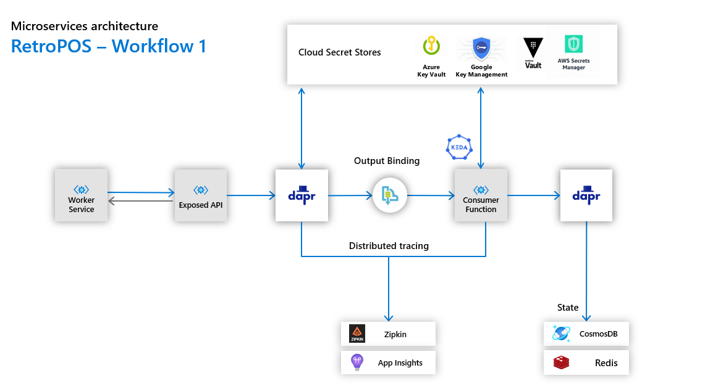

# Dapr Retro Point of Sales (Backend Workflows)

## Customer Story

Dapr Retro Point of Sales (Backend Workflows) is an event-driven microservices based architecture for Contoso Ltd., which will enable scalability with a plugable design for the next generation of cloud point of sales.

After evaluating a variety of approaches and technologies, the engineering team has decided to use technologies like .NET Core, Containers, Functions, Dapr and KEDA to enable system scalability and functionality such as reliable state, bindings, triggers, distributed tracing, secret management, service to service invocation. 

## Learning along the way

These set of workflows intents to be a part of a production ready architecture, tested under heavy loads and mitigating possible scalability issues by using modern microservices practices, that can be use to learn on the road, we encourage to deploy the solution and learn on the road by exploring each component and configuration. In order to make this project achievable there are some technologies predefined, however, you can add or remove components in your own design to make it more flexible.

## Prerequisites

| Attribute | Details |
|--------|--------|
| [Dapr runtime version](https://github.com/dapr/docs/blob/master/getting-started/environment-setup.md#prerequisites) | 0.10.0 |
| [KEDA](https://keda.sh/) | 1.5.0 |
| [HELM](https://helm.sh/docs/intro/install/) | 3.2.1 |
| [.NET Core](https://dotnet.microsoft.com/download/dotnet-core/3.1) | 3.1 |
| [Azure Functions Core Tools](https://docs.microsoft.com/en-us/azure/azure-functions/functions-run-local) | 3.x |
| [Azure CLI](https://docs.microsoft.com/en-us/cli/azure/install-azure-cli?view=azure-cli-latest) | 2.12.1 |
| [Docker Desktop](https://docs.docker.com/engine/install/) | 2.4.0.0 |
| [Visual Studio Community 2019 or Code](https://visualstudio.microsoft.com/es/downloads/) | Required |
| [Azure Subscription](https://portal.azure.com/) | Required |
| [Language](#) | C# |
| [Environment](#) | Local or Kubernetes |

## Index

1. [Azure Deployment](README-AzureDeployment.md)
    - Deploy or remove all resources used by the solution with these scripts.
2. [Kubernetes Service Setup](README-KubernetesSetup.md)
    - Configure all the Kubernetes Service components used by the solution.
3. [Workflow 1 - API to Queue / Queue to Function](README-Workflow-1.md)

    | diagram  | description |
    |---|---|
    | 

 | The purpose of this workflow it's to represent an exposed API that will be receiving messages from an external worker service, these messages will be stored in the Azure Service Bus Queue and eventually they will be consumed and processed by a ServiceBusTrigger Function to finally send the results to an storage. |

## Credits

I want to thank to my Cloud Native Global Black Belt team (aka. Dapr Vigilantes) for this great contribution: https://github.com/azure/dapr-gbb-workshop that I used to accelerate my learning and adoption of Dapr.

I want to thank Houssem Dellai (@houssemdellai) for this great contribution: https://github.com/houssemdellai/aks-keyvault that I used to create part of the AAD Pod Identity documentation.